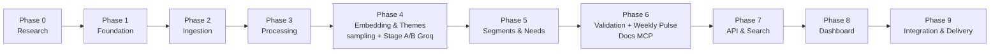
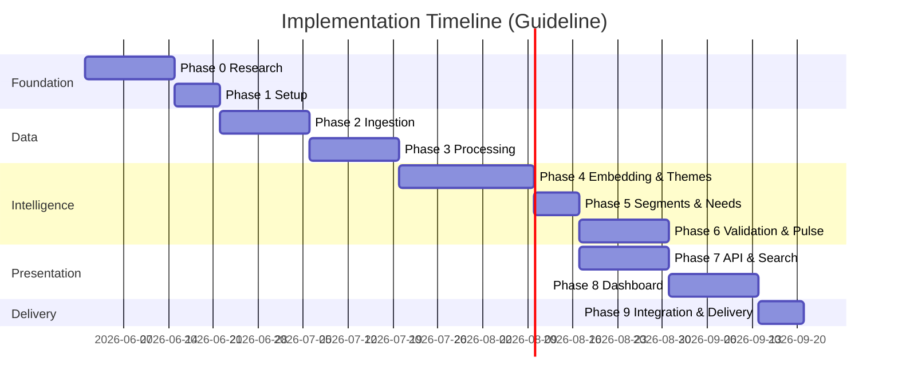

# Phase-Wise Implementation Plan

## AI-Powered Review Discovery Engine for Spotify

This document organizes the project into sequential phases aligned to `docs.md/Problem Statement.md` and `System Architecture.md`. Each phase delivers the engine components required to answer the six research questions, maintain privacy, ground every AI claim in evidence, and produce both an interactive dashboard/chatbot and a weekly pulse written to Google Docs via MCP.

The scope in `docs.md/Problem Statement.md` is preserved: the Streamlit dashboard, RAG chatbot, Chroma vector store, privacy rules, and the max-5-theme constraint all remain. The updated architecture adds **stratified sampling**, a **two-stage Groq pipeline**, a **deterministic validation layer**, and **Google Docs MCP delivery** of a weekly pulse. There is **no Gmail / email delivery** in this milestone.

---

## Phase Overview



| Phase | Name | Primary Focus | Estimated Duration |
|---|---|---|---|
| 0 | Research & Planning | Define problem, scope, and architecture | 1 week |
| 1 | Foundation | Project setup, schema, and tooling | 1 week |
| 2 | Ingestion | Import public Play Store reviews | 1 week |
| 3 | Processing | Clean, anonymize, normalize reviews | 1 week |
| 4 | Embedding & Themes | Local embeddings, stratified sampling, two-stage Groq theme cards | 1–2 weeks |
| 5 | Segments & Needs | Segment inference and unmet needs ranking | 1 week |
| 6 | Validation & Weekly Pulse | Deterministic validator + Groq pulse drafting + Google Docs MCP delivery | 1–2 weeks |
| 7 | API & Search | Backend endpoints, search, and chat retrieval | 1–2 weeks |
| 8 | Dashboard | Streamlit UI with five tabs and evidence UX | 1–2 weeks |
| 9 | Integration & Delivery | End-to-end testing, privacy audit, final handoff | 1 week |

---

## Phase 0 — Research & Planning

**Goal:** Confirm the engine requirements, data scope, and technical approach before implementation.

### Objectives

- Document the six research questions and required outputs
- Choose tools that satisfy local embeddings, Chroma store, and Groq grounding
- Define privacy rules and grounding constraints
- Align architecture with the problem statement scope

### Tasks

| # | Task | Output |
|---|---|---|
| 0.1 | Capture the new problem statement and build acceptance criteria | Problem statement doc |
| 0.2 | Confirm public Play Store export ingestion only | Ingestion scope note |
| 0.3 | Specify local embedding and vector store approach | Tool choice doc |
| 0.4 | Define theme, segment, and unmet needs outputs | Requirements mapping |
| 0.5 | Document privacy and grounding rules | Privacy checklist |

### Exit Criteria

- Problem statement documented in `docs.md/Problem Statement.md`
- Architecture aligned to the six research questions
- Privacy-first and zero Groq quota embedding requirements captured
- Phase plan ready for execution

---

## Phase 1 — Foundation

**Goal:** Establish the project structure, environment, and base schema.

### Objectives

- Build the repository scaffold and dependency environment
- Define the review and insight data models
- Establish configuration and logging utilities
- Create documentation entry points

### Tasks

| # | Task | Output |
|---|---|---|
| 1.1 | Initialize repository folders and Python environment | Repo scaffold |
| 1.2 | Add config, logging, and error-handling utilities | Utility modules |
| 1.3 | Define review schema with metadata and PII fields | Schema doc / SQL |
| 1.4 | Create README and `.env.example` templates | Project docs |
| 1.5 | Add placeholder API and dashboard entry points | Initial app shell |

### Exit Criteria

- Project boots locally with dependencies
- Data schema is documented and ready
- Basic project utilities are available

---

## Phase 2 — Ingestion

**Goal:** Ingest 8–12 weeks of public Spotify Play Store reviews via export only.

### Objectives

- Build an ingestion flow that reads public export files
- Capture review metadata including rating, version, thumbs-up count
- Keep the source model compliant with public export data only
- Make date range configurable for 8–12 week windows

### Tasks

| # | Task | Output |
|---|---|---|
| 2.1 | Build Play Store review export parser | Importer module |
| 2.2 | Extract required metadata and normalize source tags | Raw review records |
| 2.3 | Persist raw data in a local raw store | Raw review store |
| 2.4 | Document export requirements and ingestion steps | README/docs |

### Exit Criteria

- Only public export data is ingested
- Review records include required metadata fields
- Ingestion is date-range configurable

---

## Phase 3 — Processing

**Goal:** Clean and normalize raw reviews into a privacy-safe processed corpus.

### Objectives

- Remove PII and reviewer-identifying data
- Normalize text and timestamps
- Drop emoji-only and low-content reviews
- Deduplicate near-duplicate reviews
- Retain English reviews and flag others for future expansion

### Tasks

| # | Task | Output |
|---|---|---|
| 3.1 | Clean text, strip HTML, whitespace and repeated punctuation | Clean review text |
| 3.2 | Remove usernames, emails, device IDs and other identifiers | PII-free corpus |
| 3.3 | Deduplicate by text hash / similarity | Deduplicated dataset |
| 3.4 | Filter for English-language content | English-only processed corpus |
| 3.5 | Persist processed reviews to local storage | Processed review store |

### Exit Criteria

- No PII is present in processed records
- Reviews are normalized and deduplicated
- Processed dataset is ready for embedding

---

## Phase 4 — Embedding & Themes

**Goal:** Generate local embeddings, stratified-sample the corpus, and use a two-stage Groq pipeline to cluster reviews into up to 5 themes with evidence-cited narrative cards.

**Maps to:** System Architecture §5.2 (Embedding + Chroma), §5.3 (stratified sampling + Stage A theme discovery + Stage B narrative cards).

### Objectives

- Use local sentence-transformers/all-MiniLM-L6-v2 for embeddings (zero Groq quota cost)
- Persist embeddings in a local Chroma store, reused for clustering and RAG retrieval
- Stratified-sample by rating tier × ISO week before any LLM call (oversample negatives, cap per week, reproducible seed)
- **Stage A (Groq):** discover ≤5 discovery/recommendation themes with labels and supporting `review_id`s
- **Stage B (Groq):** generate human-readable narrative cards (≤250 words) with representative quotes
- Flag anomalous weekly spikes separately

### Tasks

| # | Task | Output |
|---|---|---|
| 4.1 | Embed processed review text locally | Review vectors |
| 4.2 | Persist vectors in Chroma (metadata: review_id, rating, date, platform) | Local vector store |
| 4.3 | Stratified sample (rating tier × ISO week) with caps + seed in run metadata | Reproducible sample |
| 4.4 | Stage A — Groq theme discovery (≤5 themes, labels, supporting review_ids) | Theme clusters |
| 4.5 | Stage B — Groq narrative cards (≤250 words) with names and quotes | Theme cards |
| 4.6 | Extract representative quotes with review_id citations | Quote records |
| 4.7 | Detect anomalous weeks separate from evergreen themes | Anomaly markers |

### Exit Criteria

- Local embeddings and Chroma persistence work; same index serves clustering and retrieval
- Sampling is reproducible (seed + caps recorded) and never sends the full corpus to Groq
- Themes are limited to a maximum of 5
- Each theme includes a readable name, ≤250-word card, quotes, and evidence count
- Anomalous weeks are identified clearly

---

## Phase 5 — Segments & Needs

**Goal:** Infer directional user segments and rank unmet needs from review signal.

### Objectives

- Approximate segments via rating tier, premium/free mentions, tenure language, and version/device cues
- Build directional segment cards with volume, top frustration, and quote
- Extract recurring unmet needs from desire/request language
- Rank unmet needs by frequency and evidence strength

### Tasks

| # | Task | Output |
|---|---|---|
| 5.1 | Infer segments from text and metadata | Segment candidates |
| 5.2 | Build segment summaries with quotes | Segment cards |
| 5.3 | Extract unmet needs from `I wish`, `please add`, `why can't` statements | Need candidates |
| 5.4 | Rank unmet needs by count and evidence strength | Ranked unmet needs |
| 5.5 | Persist segment and needs data | Analysis store |

### Exit Criteria

- Segment inference is directional and evidence-based
- Unmet needs are ranked and supported by review excerpts
- Segment and need outputs are ready for validation and API delivery

---

## Phase 6 — Validation & Weekly Pulse (Docs MCP)

**Goal:** Add the deterministic validation layer that gates external writes, draft the weekly pulse with Groq, and deliver it to Google Docs via MCP.

**Maps to:** System Architecture §5.3 (Stage B pulse drafting), §5.5 (validation layer), §5.6 (Docs MCP delivery). **No Gmail / email delivery.**

### Objectives

- Build a deterministic validator that runs before any dashboard "final" state or external write
- Draft the `WeeklyPulse` with Groq: executive framing, top 3 themes, 3 verbatim quotes, 3 action ideas, ≤250 words
- Enforce constraints: theme cap (≤5), pulse structure (3/3/3), word limits, quote provenance, PII rules
- Deliver the validated pulse to Google Docs via the Docs MCP server
- Support a bounded Stage B repair retry when validation fails

### Tasks

| # | Task | Output |
|---|---|---|
| 6.1 | Implement structural checks (theme count ≤5; pulse 3 themes / 3 quotes / 3 actions) | Structural validator |
| 6.2 | Implement length check (cards & pulse ≤250 words, fixed counting policy) | Length validator |
| 6.3 | Implement quote provenance check (quote ⊆ normalized corpus + valid review_id) | Provenance validator |
| 6.4 | Implement PII block (emails, phones, @handles) across all artifacts | PII validator |
| 6.5 | Draft WeeklyPulse with Groq (Stage B) from validated themes/evidence | Candidate pulse |
| 6.6 | Add bounded repair retry that points Groq at the offending rule | Retry logic |
| 6.7 | Write validated pulse to Google Docs via MCP; capture document id + URL | DeliveryResult |
| 6.8 | Add dry-run/debug mode for development (never writes non-compliant content) | Debug path |

### Exit Criteria

- Validator rejects non-compliant output with actionable reasons
- Only validated content reaches the dashboard "final" state and the Docs MCP tool
- Weekly pulse is written to Google Docs and its link is captured for the dashboard
- Repair retry recovers common failures without re-discovering themes
- No reviewer-identifying data appears in the pulse or Doc

---

## Phase 7 — API & Search

**Goal:** Build the backend API and retrieval/search infrastructure for the dashboard.

### Objectives

- Provide endpoints for themes, segments, unmet needs, discovery search, and chat retrieval
- Support date filters and `latest` sorting across endpoints
- Return grounded review citations for every AI-driven claim
- Add semantic + keyword search over processed reviews

### Tasks

| # | Task | Output |
|---|---|---|
| 7.1 | Implement theme, segment, unmet need, stats, and weekly-pulse-link endpoints | API routes |
| 7.2 | Implement semantic + keyword search endpoint | Search results |
| 7.3 | Implement grounded RAG chat endpoint (Groq, review_id citations, refusal on empty) | Chat responses |
| 7.4 | Add date filter support and latest sort | Filter behavior |
| 7.5 | Add API tests and documentation | Test coverage |

### Exit Criteria

- API endpoints return dashboard-ready data
- Search and chat endpoints function with citations
- Date filters are supported consistently

---

## Phase 8 — Dashboard

**Goal:** Build the Streamlit dashboard with the required five tab experiences and evidence-first presentation.

### Objectives

- Implement Overview, Themes & Chat, Segments, Unmet Needs, and Review Discovery tabs
- Display 'Based on N reviews' citations for all AI-generated claims
- Surface a link to the latest weekly pulse Google Doc
- Use a colorblind-safe palette and readable typography
- Provide expandable evidence excerpts and review citations

### Tasks

| # | Task | Output |
|---|---|---|
| 8.1 | Build Streamlit tabbed dashboard shell | UI scaffold |
| 8.2 | Implement Overview tab mapped to the six questions + weekly pulse Doc link | Overview cards |
| 8.3 | Implement Themes & Chat tab | Theme cards + chatbot |
| 8.4 | Implement Segments tab | Segment cards |
| 8.5 | Implement Unmet Needs tab | Needs list |
| 8.6 | Implement Review Discovery tab (cause search + date filters) | Search results |
| 8.7 | Add evidence citations and expandable excerpts | Evidence UX |
| 8.8 | Apply accessible palette and typography | UI polish |

### Exit Criteria

- Dashboard loads and shows live API data
- All five tabs are present and functional
- Claims include review-based citations
- UI is readable and accessible

---

## Phase 9 — Integration & Delivery

**Goal:** Validate the engine end-to-end and prepare the final delivery package.

### Objectives

- Run the full pipeline from ingestion through dashboard and weekly Docs MCP delivery
- Verify answers to the six research questions
- Confirm PII-free outputs, grounded chatbot behavior, and a valid weekly pulse Doc
- Document known limitations and future work

### Tasks

| # | Task | Output |
|---|---|---|
| 9.1 | Run end-to-end validation of ingestion, processing, analysis, dashboard, and Docs MCP delivery | Validation report |
| 9.2 | Review theme quality and evidence grounding | Quality review |
| 9.3 | Test search, filters, chat behavior, and weekly pulse generation | Test log |
| 9.4 | Perform privacy audit for PII removal (including pulse & Doc) | Privacy checklist |
| 9.5 | Finalize README and delivery notes | Delivery docs |
| 9.6 | Performance check — search and dashboard load times acceptable | Performance notes |
| 9.7 | Fix identified bugs and UX issues | Bug fix commits |
| 9.8 | Prepare demo script and sample walkthrough | Demo guide |
| 9.9 | Final code cleanup and repository organization | Clean repo |
| 9.10 | Final review against success criteria | Sign-off checklist |

### Exit Criteria

- System answers the six research questions with evidence-backed outputs
- Dashboard, chat, and weekly pulse features are validated
- Weekly pulse is written to Google Docs via MCP with only validated content
- No reviewer-identifying data is returned in any surface
- Final project documentation is complete

### Success Criteria Checklist

| Criterion | Validation Method |
|---|---|
| Analyzes large volumes of unstructured feedback | Confirm ≥ 2,000 processed reviews |
| Identifies recurring themes and pain points | Manual review of theme output |
| Groups similar feedback meaningfully | Cluster quality review |
| Evidence-backed insights | Spot-check 10 insights for quote linkage + provenance validation |
| Clean, intuitive dashboard | Usability walkthrough |
| Grounded Q&A | Chatbot answers cite review_ids; refuses when signal is empty |
| Stakeholder-readable summary | Weekly pulse written to Google Docs via MCP, links from dashboard |
| Actionable research outputs | Ranked unmet needs + weekly pulse reviewed by peer or mentor |

### Deliverables

- Fully integrated and tested system
- Demo script
- Final submission package (code + docs + report)

### Exit Criteria

- [ ] All success criteria met
- [ ] No critical bugs in dashboard or API
- [ ] Privacy audit passed
- [ ] Demo-ready system with documentation complete

---

## Phase Dependency Diagram



> **Note:** Phase 6 (Validation & Weekly Pulse) depends on Phase 4 themes and Phase 5 needs, and can run in parallel with Phase 7 (API & Search) once analysis outputs are stable.

---

## Architecture Mapping

| Phase | System Architecture Component |
|---|---|
| 0 | Problem definition, source selection, tool evaluation (§1) |
| 1 | Deployment foundation, data schema (§10, §7) |
| 2 | Review ingestion — export parsers (§5.1) |
| 3 | Processing — validation, PII removal, normalization (§5.1) |
| 4 | Embedding + Chroma + stratified sampling + Stage A theme discovery (§5.2, §5.3) |
| 5 | Segment inference + unmet needs extraction (§5.4) |
| 6 | Validation layer + Stage B pulse drafting + Docs MCP delivery (§5.5, §5.6) |
| 7 | REST API + RAG retrieval + search (§5.7, §5.8) |
| 8 | Streamlit dashboard — five tabs, cause search, date filters (§5.8) |
| 9 | Full system — all layers integrated (§8) |

---

## Risk Register

| Risk | Phase | Mitigation |
|---|---|---|
| Public export access changes / rate limits | 2 | Use public export only; cache results; keep ingestion export-agnostic |
| Insufficient discovery-focused reviews | 2 | Widen lookback window; ingest more weeks of export data |
| Poor theme cluster quality | 4 | Tune cluster count (≤5); review Stage A labels; adjust sampling caps |
| Groq quota / token limits exceeded | 4, 6 | Local embeddings (zero quota); stratified sampling; batch and pin models |
| LLM hallucinates quotes or exceeds limits | 6 | Deterministic validator (provenance, length, counts) + bounded repair retry |
| Docs MCP write fails / duplicate docs | 6 | Retry with backoff; naming/idempotency strategy; surface partial success |
| Search returns irrelevant results | 7 | Combine semantic + keyword scoring; tune relevance threshold |
| PII accidentally stored or surfaced | 3, 6, 9 | PII strip at source + validator PII block + manual privacy audit |
| Timeline slip on ingestion | 2 | Start ingestion early; keep export windows configurable |

---

## Quick Reference — What to Build When

```
Phase 0  →  Research, architecture, tool selection
Phase 1  →  Repo, DB schema, base models
Phase 2  →  Ingest public Play Store (+ optional App Store) export reviews
Phase 3  →  Clean, anonymize, deduplicate, normalize (PII-free, English-only)
Phase 4  →  Local embeddings + Chroma + stratified sampling + Stage A/B Groq theme cards
Phase 5  →  Segment inference + ranked unmet needs
Phase 6  →  Validation layer + weekly pulse drafting + Google Docs MCP delivery (no Gmail)
Phase 7  →  REST API + semantic/keyword search + RAG chat + date filters
Phase 8  →  Streamlit dashboard: 5 tabs, cause search, date filters, evidence citations
Phase 9  →  Test everything, privacy audit, demo, submit
```
