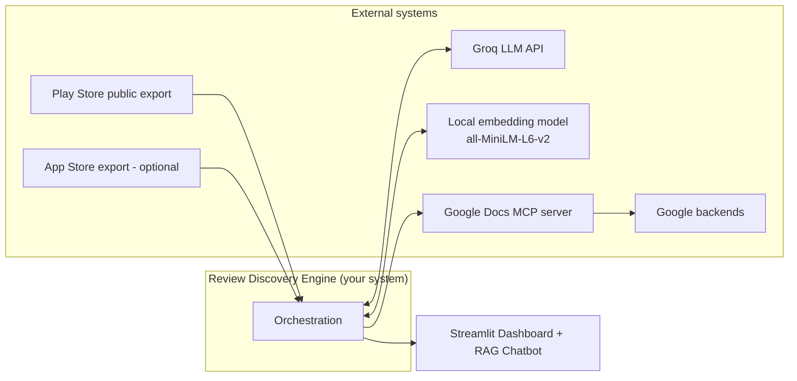
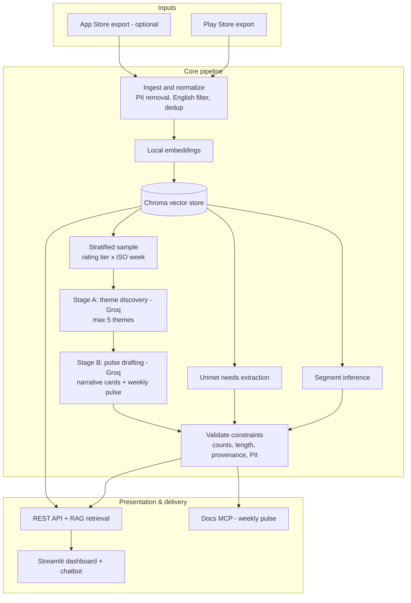
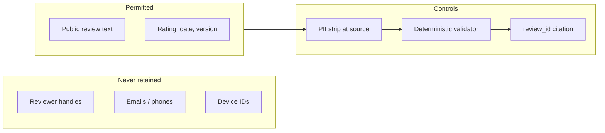
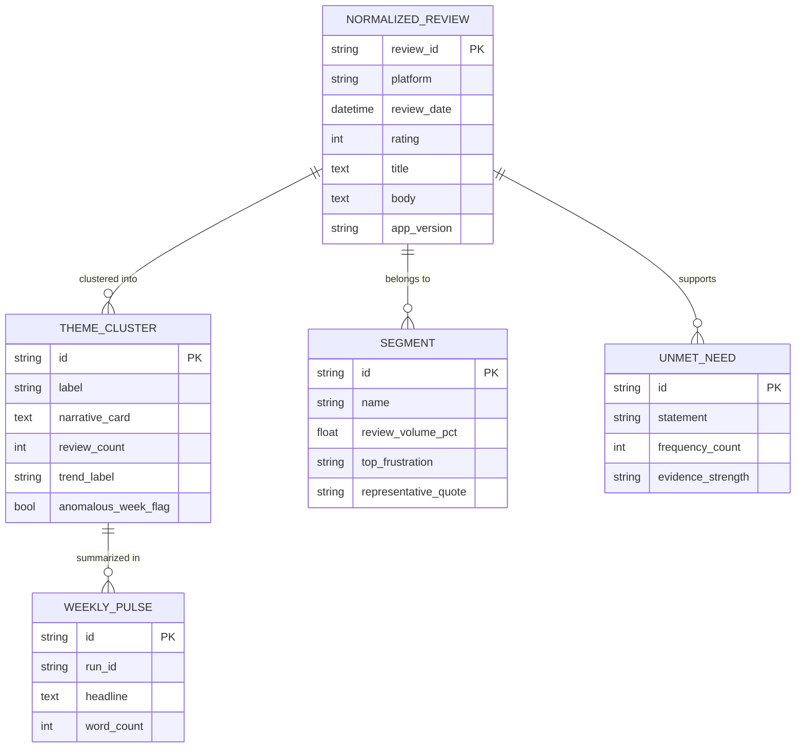
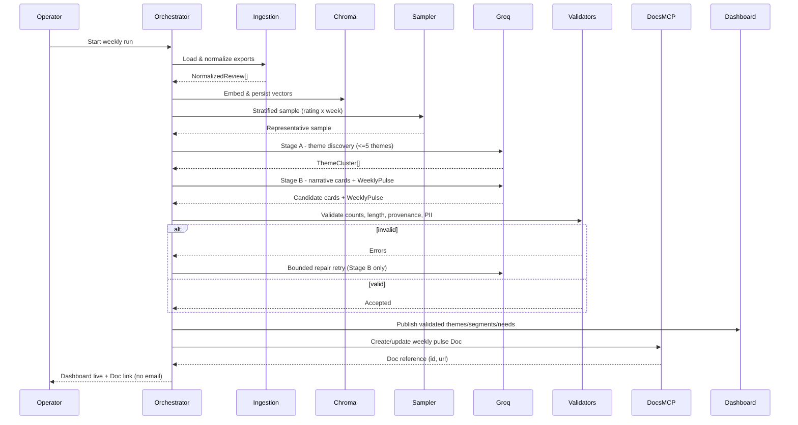
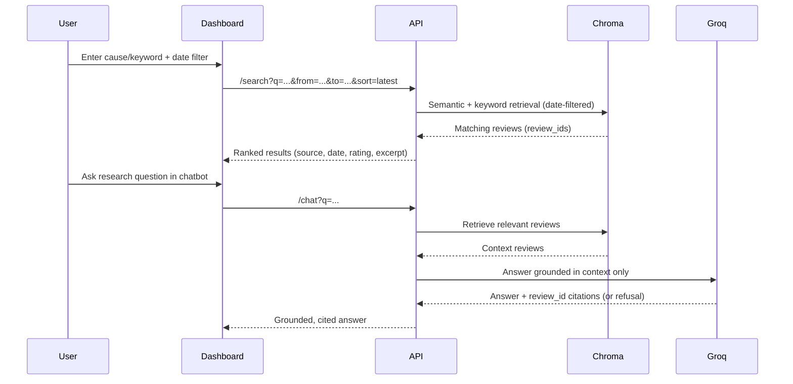

# System Architecture

## AI-Powered Review Discovery Engine — Spotify

This document describes how the Review Discovery Engine ingests public Spotify mobile-store reviews, synthesizes grounded discovery insights with an LLM, and delivers them through two consumption surfaces: an interactive **Streamlit dashboard + RAG chatbot** and a **weekly pulse document written to Google Docs via MCP**.

It is written for builders and reviewers: what subsystems exist, how data flows, where trust boundaries sit, and what must remain true for the milestone to be satisfied. It preserves the scope defined in `docs.md/Problem Statement.md` and does not change it.

---

## 1. Purpose and Scope

### 1.1 What this system does

- Ingests recent, public mobile-store reviews (Play Store primary; App Store optional) for the Spotify continuity line.
- Normalizes reviews into a single privacy-safe representation and removes all reviewer-identifying data.
- Embeds reviews locally and persists them in a file-backed **Chroma** vector store (zero Groq quota cost).
- Uses a **hybrid storage model**: **Chroma** stores embeddings for semantic retrieval, while **SQLite** stores raw reviews, cleaned reviews, theme records, sentiment scores, segment labels, insights, quotes, and weekly pulse metadata.
- Discovers a **maximum of 5 discovery/recommendation themes**, infers directional user segments, and ranks unmet needs — all evidence-cited by `review_id`.
- Answers the six research questions interactively through a **Streamlit dashboard** and a **RAG-grounded chatbot** (Groq `llama-3.3-70b-versatile`).
- Synthesizes a short **weekly pulse narrative** and writes a stakeholder-readable artifact to **Google Docs via MCP** — not a hand-rolled Google API client in the application layer.

### 1.2 Explicit non-goals

- No authenticated scraping, headless store browsing, or ToS-violating automation against storefronts — public export data only.
- No hand-rolled OAuth clients for Google Docs; the **Docs MCP server owns that surface**.
- **No Gmail delivery / email MCP** in this milestone — the pulse is archived to Google Docs and surfaced in the dashboard, not emailed.
- No open-domain chatbot answers — the RAG chatbot answers only from retrieved review content.
- No open-ended "market research agent" beyond the scoped outputs (max 5 themes, ≤250-word narrative cards, capped pulse).

### 1.3 Quality attributes (prioritized)

| Priority | Attribute | Meaning here |
|---|---|---|
| 1 | Constraint safety | Word limits, theme caps (≤5), and PII rules are enforced by a deterministic validator **before** any external write (Docs MCP) or dashboard "final" presentation. |
| 2 | Traceability | Every theme, segment, unmet need, chatbot answer, and pulse quote traces back to normalized `review_id`s; runs emit enough metadata to reproduce a demo. |
| 3 | Quota discipline | Groq usage must stay safely under `llama-3.3-70b-versatile` limits: **30 RPM**, **1K RPD**, **12K TPM**, **100K TPD**. |
| 4 | Grounding | The chatbot and all AI claims answer only from retrieved review content — explicit "not enough signal" refusal when retrieval is empty. |
| 5 | Operational simplicity | Few moving parts: ingestion → processing → embedding → analysis → validation → presentation/delivery. |
| 6 | Recoverability | Failures at MCP or Groq calls do not silently corrupt partial state; errors are visible in logs and the operator UI. |

---

## 2. Stakeholders and Consumers

| Role | Interest |
|---|---|
| Product / Growth | Prioritized themes and quotes that justify roadmap bets. |
| Support | The language users actually use; reduces mismatch between marketing and reality. |
| Leadership | One screen (or one Doc) of signal per week without raw-review noise. |
| Operator (you) | Repeatable run, live dashboard, and an archived weekly Doc link. |

**Consumption surfaces for this milestone:**

1. **Streamlit dashboard + RAG chatbot** — the interactive, always-on surface (five tabs).
2. **Weekly pulse in Google Docs (via MCP)** — the archived, stakeholder-readable narrative.

There is no email/Gmail surface in this milestone.

---

## 3. Context Diagram (external actors)

**Interpretation:** Orchestration talks to a **local model** for embeddings (no quota cost), to **Groq** for narrative synthesis and chatbot answers, and to the **Google Docs MCP server** for the weekly archived artifact. The MCP host may be the IDE, a CLI, or a job runner — the architecture stays valid across those hosts. There is no Gmail MCP.

---

## 4. High-Level Pipeline

**Ordering rules:**

- **Local embedding precedes analysis** — embeddings feed both clustering and RAG retrieval; no re-embedding at query time.
- **Stratified sampling precedes the Groq theme/pulse calls** — never send the full normalized corpus directly to the LLM.
- **Quota guardrail:** Phase 6 caps the candidate review set at **1,000 reviews**, then sends only a compressed evidence pack (top themes + selected quotes) to Groq.
- **Validation gates external writes.** If validation fails, the system must not present the output as final in the dashboard, nor call the Docs MCP tool with non-compliant content (except in an explicit, documented dry-run/debug mode used only during development).

---

## 5. Logical Components

### 5.1 Review ingestion (non-MCP)

**Responsibility:** Turn heterogeneous public export files into a single canonical representation for analysis.

- **Parsing:** Tolerate header variants, missing optional fields, and benign encoding issues.
- **Normalization:** Map platform-specific columns into shared semantics (`date`, `rating`, `title`, `body`, `platform`, `app_version`, `thumbs_up`).
- **Time windowing:** Retain only reviews within the configured **8–12 week** lookback; timezone-less dates are handled consistently.
- **Deduping:** Collapse near-duplicates (same body + close timestamp + platform).
- **PII minimization at source:** Remove reviewer handles, emails, and device IDs; never retain them downstream.

**Outputs:** A bounded collection of `NormalizedReview` records consumed only by downstream analysis.

**Failure modes:** Unreadable files → actionable error; partial files → ingest what is valid and surface warnings.

### 5.2 Embedding + Vector Store (local, zero quota)

**Responsibility:** Represent each normalized review as a vector for clustering and retrieval.

- Embeds with `sentence-transformers/all-MiniLM-L6-v2` locally — **no Groq quota cost**.
- Persists vectors + minimal metadata (`review_id`, `rating`, `review_date`, `platform`) to a file-backed **Chroma** store.
- The same store serves **theme clustering** and **RAG retrieval** — one index, two consumers.
- SQLite remains the system of record for structured data and relational links; Chroma is the semantic index, not the replacement for the whole database.

### 5.3 Analysis and pulse drafting (LLM-centric)

**Responsibility:** Transform normalized reviews into structured, evidence-backed insights matching the milestone format.

**LLM provider:** **Groq** (OpenAI-compatible HTTP API), `llama-3.3-70b-versatile`, used for narrative synthesis and chatbot answering. Groq's high tokens/sec keeps the staged pattern interactive; its large-context Llama-class models comfortably fit the sampled inputs. Model + prompt-version pinning is recorded in `decision.md`.

**Model limits that shape the implementation:**

- **Requests per minute:** 30
- **Requests per day:** 1,000
- **Tokens per minute:** 12,000
- **Tokens per day:** 100,000

**Pre-LLM stratified sampling (cost & quality control):** Before the first Groq call, the pipeline samples over the normalized set:

- Bucket by **rating tier** (negative ≤2★, neutral 3★, positive 4–5★) × **ISO week**.
- Apply per-tier per-week caps that oversample negative reviews (they carry the actionable signal) without letting a single high-volume week dominate.
- Carry `seed` + caps in run metadata so the sample is reproducible.
- This converts thousands of normalized reviews into hundreds of representative inputs.

**Two-stage Groq call sequence:**

- **Stage A — Theme discovery.** Send the stratified sample with `(rating, review_date, review_id, body)` and request **≤5 themes**, each with a human-readable label, a one-line description, and supporting `review_id`s. (Satisfies the max-5-theme constraint.)
- **Stage B — Narrative + pulse drafting.** Send the discovered themes plus supporting evidence and request:
  - Per-theme **narrative cards (≤250 words each)** with representative quotes and `review_id` citations, for the dashboard.
  - A condensed **WeeklyPulse** for the Google Doc: executive framing, **top 3 themes**, **3 verbatim quotes** drawn from supplied bodies, **3 action ideas**, total **≤250 words**.

A **bounded repair retry** is permitted at Stage B if validation rejects the output (e.g., quote provenance fails or word count exceeds the limit).

**Why staged, not monolithic:** theme discovery and compressed-narrative writing are different cognitive tasks; Stage B sees only the evidence it needs, keeping quote provenance auditable; failures are localized so a bad pulse can be regenerated without re-discovering themes.

### 5.3.1 Current quota-aware implementation path

The target design remains Stage A + Stage B, but the **current Phase 6 implementation** is deliberately more conservative so it does not hit Groq limits:

- It works from the **already-stored Phase 4 outputs** (`themes`, `quotes`, `review_themes`) instead of sending raw review text for theme discovery again.
- It first builds a **stratified sample capped at 1,000 reviews** from the processed corpus.
- It then compresses that sample into a small evidence pack: **top 3 themes** from the sampled set plus **up to 12 candidate quotes**.
- Groq is used for **one primary pulse-drafting call** and **at most one repair retry** if validation fails.
- If Groq is not configured, the system produces a deterministic fallback pulse so the pipeline still runs.

This keeps Phase 6 comfortably within the model budget while still producing a grounded weekly pulse.

### 5.4 Segment inference and unmet needs (deterministic + LLM-assisted)

**Responsibility:** Produce the dashboard's Segments and Unmet Needs views from review signal.

- **Segments:** Approximate directional clusters from rating tier, free/premium text mentions, tenure language, and version/device cues. Each shows name, % of review volume, top frustration, and a representative quote. These are directional behavioral clusters, **not** ground-truth personas.
- **Unmet needs:** Distill recurring "I wish / I want / why can't / please add" statements into a ranked list with frequency count, evidence strength (Low/Medium/High), and 2–3 source excerpts.

### 5.5 Validation layer (deterministic)

**Responsibility:** The contract enforcer between creative LLM output and the outside world (dashboard "final" state and Docs MCP writes).

| Check | Rule |
|---|---|
| Structural | Correct counts: ≤5 theme clusters; WeeklyPulse has exactly 3 themes / 3 quotes / 3 actions. |
| Length | Theme narrative cards and WeeklyPulse body ≤250 words under an explicit, fixed counting policy. |
| Provenance | Every quote ⊆ normalized corpus (substring / normalized-whitespace match) and carries a valid `review_id`. |
| PII | Block emails, phone numbers, and `@handles`; no reviewer-identifying data in any artifact — including chatbot answers. |

**Outputs:** Either **accept** (hand off to dashboard/Docs MCP) or **reject with reasons** suitable for automated repair retry or human intervention. This layer is what makes MCP writes boring — inputs are already bounded.

### 5.6 MCP delivery — Google Docs

**Responsibility:** Persist the weekly pulse where stakeholders read narrative reports.

- Create a new document per run/week (or update an append-only master log — choice recorded in `decision.md`).
- Apply readable structure: title, date range, sections for themes / evidence / actions.
- Capture returned identifiers (`document_id`, `url`) for correlation with logs and the dashboard.
- **Only validated pulse content** is passed into MCP tool arguments. Errors from Google or MCP are surfaced; retries respect idempotency (avoid duplicate docs when "create" is ambiguous).
- The application layer does **not** call Google APIs directly. It invokes a **host-provided MCP command bridge** (configured by environment), with `--dry-run` saving a local preview when the MCP command is not available.

### 5.7 RAG-grounded chatbot

**Responsibility:** Answer the six research questions from retrieved review content only.

- Retrieves the most relevant reviews from Chroma, then asks Groq to answer **only** from that context.
- Every answer cites source `review_id`s; explicit "not enough signal" refusal when retrieval is empty.
- Starter questions are pre-mapped to the six research questions.

### 5.8 Presentation — Streamlit dashboard

**Responsibility:** Interactive, evidence-first consumption surface.

- Five tabs: **Overview, Themes & Chat, Segments, Unmet Needs, Review Discovery**.
- Overview maps key metrics to the six research questions.
- Every AI claim shows a "Based on N reviews" tag with expandable source excerpts.
- **Cause search box** (semantic + keyword) and a **shared date-filter bar** (latest-first default, presets, custom range) apply consistently across panels.
- Surfaces a link to the latest weekly pulse Google Doc.
- Colorblind-safe palette, minimum contrast, readable fonts.

### 5.9 Orchestration, configuration, and observability

- **Orchestration** sequences phases, carries context (`run_id`, week bounds), and decides behavior on validation failure.
- **Configuration (non-secret):** lookback weeks, product display name, sampling caps/seed, theme-ranking flags, retry counts.
- **Secrets:** Groq API key and Docs MCP credentials live outside the repo (env vars / secret store consumed by the MCP host).
- **Observability (minimum viable):** `run_id`, ingest counts, sample size, validation outcome, Doc reference, model id, and prompt version for reproducibility.

---

## 6. Trust Boundaries and Privacy

| Boundary | Inside | Must not leak outward |
|---|---|---|
| Exports → Normalization | Raw export blobs | Unredacted reviewer identifiers into logs |
| Normalization → LLM / Chroma | Review text needed for theming & retrieval | Fields promised to strip (handles, emails, device IDs) |
| LLM → Validators | Draft themes / pulse / chat answer | Treat as untrusted until validated |
| Validators → Dashboard / Docs MCP | Validated content only | Anything that failed validation |

**Principle:** Assume the LLM can hallucinate structure and quotes; validators assume **zero trust** for counts, quotes, and PII.

---

## 7. Data Contracts (logical model)

These describe interfaces between stages; storage format (Chroma vectors, SQLite rows, in-memory structs) is an implementation detail.

| Artifact | Carries | Consumers |
|---|---|---|
| `NormalizedReview` | Stable `review_id`, platform, date, rating, title, body, app_version | Embedding, analysis, quote provenance checks |
| `ReviewEmbedding` | `review_id`, vector, minimal metadata | Chroma semantic index, clustering, RAG retrieval |
| `ThemeCluster` | Theme id/label, description, member `review_id`s, narrative card (≤250 words), trend, anomalous-week flag | Dashboard, pulse drafting, ranking |
| `Segment` | Name, % review volume, top frustration, representative quote | Dashboard Segments tab |
| `UnmetNeed` | Statement, frequency count, evidence strength, 2–3 excerpts | Dashboard Unmet Needs tab |
| `WeeklyPulse` | Executive headline, top 3 themes, 3 quotes, 3 actions, word count | Validators, Docs MCP |
| `ChatAnswer` | Answer text, cited `review_id`s, refusal flag | Dashboard chatbot |
| `DeliveryResult` | Doc locator (`document_id`, `url`), timestamps, `run_id` | Logging, dashboard link, demo narrative |

**Versioning:** When an artifact shape changes (e.g., adding an evidence subsection to the pulse), bump an internal schema version and record breaking changes in `decision.md`.

---

## 8. Sequence: happy path (weekly run)

### Interactive search & chat flow

---

## 9. Failure and Retry Philosophy

| Failure | Desired behavior |
|---|---|
| Malformed export | Stop early with a readable diagnostic; partial ingest only if explicitly supported. |
| Groq Stage A invalid JSON | Bounded retries with a stricter system prompt; abort if still invalid. |
| Groq Stage B fails validation | Bounded repair retries with corrective instructions pointing at the offending rule. |
| Groq budget pressure | Reduce the candidate set to the 1,000-review cap and keep the evidence pack compact; never send the full corpus. |
| Docs MCP transient error | Retry with backoff; avoid duplicate docs via naming/idempotency strategy. |
| RAG retrieval empty | Chatbot returns explicit "not enough signal" refusal — never open-domain speculation. |
| Auth expiry (Groq or Docs MCP) | Operator-visible message; no silent fallback to alternate credentials. |

---

## 10. Deployment Shapes

- **Interactive mode:** Operator runs the flow in an MCP-capable environment (IDE agent session or CLI). Best for demos and iteration; the dashboard runs locally.
- **Batch mode:** A scheduler invokes the same orchestration weekly to refresh the dashboard data and write the weekly Doc. Adds requirements around unattended auth refresh for the Docs MCP server.

The logical architecture is identical across shapes; only scheduling, secrets management, and alerting differ. For graduation-project scope, a single-deployment Python app (backend + Streamlit + SQLite/Chroma) is sufficient.

---

## 11. Deliverables & Related Documents

| Deliverable | Architectural component |
|---|---|
| README | Setup, data sources, privacy, NLP/Groq approach, theme methodology, limitations |
| Dashboard | Streamlit — five tabs, cause search, date filters, RAG chatbot, evidence citations |
| Weekly Pulse (Google Doc) | Validated `WeeklyPulse` written via Docs MCP |
| Insight outputs | Themes, segments, unmet needs — all evidence-cited by `review_id` |

| Document | Role |
|---|---|
| `docs.md/Problem Statement.md` | Requirements and constraints (scope source of truth — unchanged) |
| `Phase wise architecture.md` | Phased delivery detail aligned to this architecture |
| `docs.md/Learning Log.md` | Plain-language running log of changes |

---

## 12. Success Criteria Alignment

| Success criterion | Architectural enabler |
|---|---|
| Analyze large volumes of unstructured feedback | Local embedding + Chroma + stratified sampling |
| Identify recurring themes and pain points | Stage A theme discovery (≤5 themes) + narrative cards |
| Group similar feedback meaningfully | Semantic clustering over Chroma vectors |
| Evidence-backed insights | `review_id` citations + deterministic provenance validation |
| Clean, intuitive dashboard | Streamlit five-tab UI with cause search + date filters |
| Grounded Q&A | RAG chatbot answering only from retrieved reviews |
| Stakeholder-readable summary | Weekly pulse written to Google Docs via MCP |
| Actionable research outputs | Ranked unmet needs + top-3-theme weekly pulse with action ideas |
