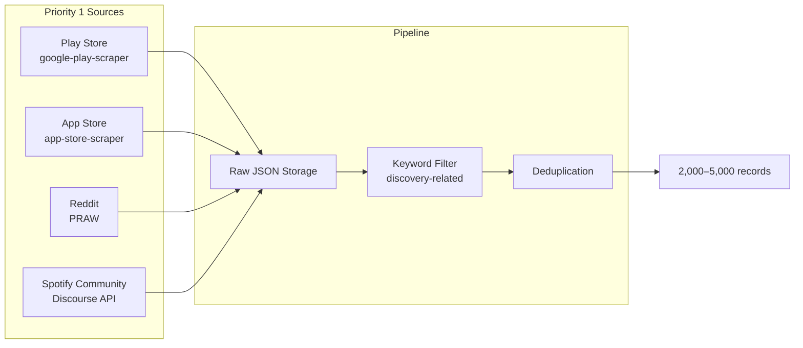

# Phase 0 — Data Source Feasibility Matrix

**Date:** 2026-06-27  
**Purpose:** Tasks 0.2 & 0.3 — Audit permitted data sources, collection methods, ToS considerations, and rate limits.

---

## Summary Matrix

| Source | Public Access | Collection Method | Est. Volume | Feasibility | Priority |
|---|---|---|---|---|---|
| Google Play Store | Yes | `google-play-scraper` (Python) | 500–1,500 reviews | **High** | P1 |
| Apple App Store | Yes | `app-store-scraper` / iTunes RSS API | 500–1,000 reviews | **High** | P1 |
| Reddit | Yes | PRAW (OAuth script app) | 500–1,500 posts/comments | **High** | P1 |
| Spotify Community | Yes | Discourse public JSON API | 300–800 posts | **Medium–High** | P1 |
| Social Media (optional) | Partial | Manual / limited API | 200–500 posts | **Low–Medium** | P2 |

**Verdict:** All four primary sources are publicly accessible and feasible for a graduation project. Social media is optional and deprioritized due to API restrictions.

---

## 1. Google Play Store

| Attribute | Detail |
|---|---|
| **App ID** | `com.spotify.music` |
| **Access type** | Public review pages (no official consumer API) |
| **Recommended tool** | [`google-play-scraper`](https://pypi.org/project/google-play-scraper/) (Python, no API key) |
| **Data available** | Review text, star rating, timestamp, reviewer name, app version |
| **Rate limits** | ~200 reviews per request; paginate with continuation tokens; add `sleep_milliseconds` between pages |
| **ToS note** | Google Play Developer API is publisher-only. This library reverse-engineers public endpoints — acceptable for academic research on public reviews; avoid aggressive scraping |
| **Volume estimate** | Spotify has millions of reviews; filter post-collection for discovery-related keywords → expect 500–1,500 relevant reviews from 3,000–5,000 raw pulls |
| **Collection strategy** | Fetch reviews sorted by NEWEST and MOST_RELEVANT; filter by keyword; store raw JSON |

### Sample Collection Approach

```python
from google_play_scraper import Sort, reviews_all

results = reviews_all(
    "com.spotify.music",
    sleep_milliseconds=500,
    lang="en",
    country="us",
    sort=Sort.NEWEST,
)
```

---

## 2. Apple App Store

| Attribute | Detail |
|---|---|
| **App ID** | `324684580` (Spotify: Music and Podcasts) |
| **Access type** | Public iTunes Customer Reviews RSS feed |
| **Recommended tool** | [`app-store-scraper`](https://github.com/cowboy-bebug/app-store-scraper) or `app-store-web-scraper` |
| **Data available** | Review title, content, rating, date, author name |
| **Rate limits** | Max **500 reviews per app per country** (10 pages × 50 reviews); fetch `mostRecent` and `mostHelpful` sorts for variety |
| **ToS note** | Uses Apple's public RSS feed — same data visible to any App Store visitor |
| **Volume estimate** | 500 raw reviews max per sort/country; combine US + UK + `mostRecent`/`mostHelpful` → ~800–1,000 unique after dedup; ~400–600 discovery-related after keyword filter |
| **Collection strategy** | Scrape US store first; optionally add `gb` for more volume; deduplicate by review ID |

### RSS Endpoint (reference)

```
https://itunes.apple.com/{country}/rss/customerreviews/page={page}/id=324684580/sortby=mostrecent/json
```

---

## 3. Reddit

| Attribute | Detail |
|---|---|
| **Access type** | Public subreddit posts and comments via Reddit API |
| **Recommended tool** | [PRAW](https://praw.readthedocs.io/) (Python Reddit API Wrapper) |
| **Auth required** | Yes — free OAuth script app ([create at reddit.com/prefs/apps](https://www.reddit.com/prefs/apps)) |
| **Rate limits** | ~**100 requests/minute** (authenticated, non-commercial); PRAW auto-handles via `X-Ratelimit-*` headers |
| **ToS note** | Non-commercial research qualifies for free tier; must use descriptive `user_agent`; no paid Pushshift archive needed |
| **Volume estimate** | r/spotify and r/truespotify yield hundreds of discovery-related threads; target 500–1,500 comments/posts |
| **Collection strategy** | Search subreddits by keyword; fetch hot/top/year posts; expand comment trees; cache results locally |

### Rate Limit Best Practices

- Use authenticated PRAW instance (not read-only anonymous — 10 req/min limit)
- Set `ratelimit_seconds=300` for automatic retry on 429 errors
- Cache API responses to disk to avoid re-fetching
- Batch with `limit=100` per request

---

## 4. Spotify Community

| Attribute | Detail |
|---|---|
| **Platform** | [community.spotify.com](https://community.spotify.com) — hosted on **Discourse** |
| **Access type** | Public JSON API (same content visible to anonymous visitors) |
| **Recommended tool** | Direct HTTP requests to Discourse endpoints (no Apify needed) |
| **Auth required** | No — for public boards |
| **Rate limits** | Discourse default ~60 requests/minute per IP; add 1s delay between requests |
| **ToS note** | Collecting public forum posts is distinct from scraping Spotify's music/streaming API. Do **not** use Spotify Developer API for listenership metrics — out of scope and prohibited |
| **Volume estimate** | 300–800 posts from targeted boards and keyword search |
| **Collection strategy** | Use `/search.json?q=...` and board-specific endpoints |

### Key Discourse Endpoints

| Endpoint | Purpose |
|---|---|
| `GET /search.json?q={query}` | Full-text search across forum |
| `GET /c/content-questions/{id}.json` | Content Questions board |
| `GET /c/live-ideas/{id}.json` | Live Ideas board |
| `GET /t/{topic_id}.json` | Full thread with all posts |

### Relevant Boards

- **Content Questions** — recommendation and discovery complaints
- **Help** categories — user frustration threads
- **Ideas / Live Ideas** — feature requests around discovery

---

## 5. Social Media (Optional — P2)

| Platform | Feasibility | Notes |
|---|---|---|
| Twitter/X | Low | API paid tiers; not recommended for graduation scope |
| YouTube comments | Medium | Public but harder to filter; manual or `yt-dlp` comments |
| TikTok | Low | No reliable free public API |

**Decision:** Deprioritize social media unless primary sources fall short of 2,000 records. Reddit and community forums cover similar unstructured discussion use cases.

---

## Collection Strategy Summary



### Recommended Collection Order

1. **Reddit** — richest discussion content; start here for quality
2. **Google Play Store** — highest review volume
3. **Spotify Community** — most on-topic for discovery features
4. **Apple App Store** — supplement volume (500 cap per sort)

---

## Legal & Ethical Constraints

| Rule | Applies To |
|---|---|
| Public content only | All sources |
| No PII storage beyond public usernames | All sources — anonymize before analysis |
| No Spotify internal/streaming data | Do not use Spotify Web API for user listening data |
| Respect rate limits | All sources — add delays, cache responses |
| Academic / non-commercial use | Reddit API, all scrapers |
| Attribute source platform in every insight | Required by problem statement |

---

## Exit Criteria — Data Sources

- [x] Google Play Store — confirmed publicly accessible via `google-play-scraper`
- [x] Apple App Store — confirmed via public iTunes RSS feed (500 review cap noted)
- [x] Reddit — confirmed via PRAW with free OAuth app
- [x] Spotify Community — confirmed via Discourse public JSON API
- [x] Collection strategy documented per platform
