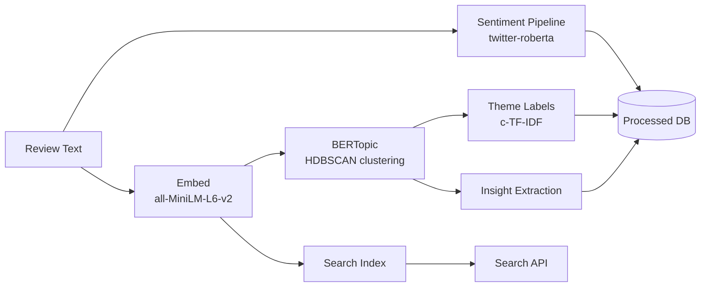

# Phase 0 — NLP Tool Selection

**Date:** 2026-06-27  
**Purpose:** Task 0.5 — Evaluate NLP/LLM options and select the stack for sentiment analysis, embeddings, theme clustering, and search.

---

## Selection Summary

| Task | Selected Tool | Rationale |
|---|---|---|
| Sentiment analysis | `cardiffnlp/twitter-roberta-base-sentiment-latest` via Hugging Face `pipeline` | Strong on informal/social text; free; runs locally |
| Text embeddings | `all-MiniLM-L6-v2` via `sentence-transformers` | Fast, lightweight, 384-dim vectors; ideal for 2k–5k records |
| Theme clustering | **BERTopic** | Embedding + clustering + auto-labeling; modular; proven for review data |
| Keyword extraction | BERTopic built-in c-TF-IDF + optional KeyBERT | No separate tool needed |
| Semantic search | Reuse `all-MiniLM-L6-v2` embeddings + cosine similarity | Same vectors for clustering and dashboard search |
| Optional LLM labeling | OpenAI / local LLM (Phase 4 optional) | For human-readable theme names if c-TF-IDF labels are weak |

**Decision:** Fully **open-source, local-first** stack. No paid API required for core pipeline. Optional LLM for theme label refinement only.

---

## Tool Comparison

### Sentiment Analysis

| Tool | Pros | Cons | Cost | Verdict |
|---|---|---|---|---|
| **Hugging Face `transformers` pipeline** | Pre-trained models; runs offline; good accuracy | Requires ~500MB model download | Free | **Selected** |
| VADER (NLTK) | Fast, rule-based, no GPU | Weak on nuanced/ironic social text | Free | Fallback only |
| TextBlob | Simple API | Low accuracy on informal text | Free | Not selected |
| OpenAI GPT sentiment | High quality | Paid; not reproducible offline; overkill | Paid | Not selected |

**Selected model:** `cardiffnlp/twitter-roberta-base-sentiment-latest`  
- Labels: `negative`, `neutral`, `positive`  
- Trained on tweets — handles informal language well (Reddit, app reviews)

---

### Text Embeddings

| Tool | Pros | Cons | Cost | Verdict |
|---|---|---|---|---|
| **`all-MiniLM-L6-v2`** (sentence-transformers) | Fast; 384 dims; strong MTEB scores for size | Less accurate than larger models | Free | **Selected** |
| `BAAI/bge-base-en-v1.5` | Higher accuracy | Slower; 768 dims; more memory | Free | Alternative if quality insufficient |
| OpenAI `text-embedding-3-small` | High quality | Paid; data sent externally | Paid | Not selected |
| spaCy `en_core_web_md` | Integrated with spaCy pipeline | Weaker semantic similarity vs transformers | Free | Not selected for embeddings |

**Selected model:** `sentence-transformers/all-MiniLM-L6-v2`  
- Embedding dimension: 384  
- Encode 5,000 reviews in ~2–5 minutes on CPU

---

### Theme Clustering / Topic Modeling

| Tool | Pros | Cons | Cost | Verdict |
|---|---|---|---|---|
| **BERTopic** | Transformer embeddings + HDBSCAN + c-TF-IDF; modular | Requires tuning `min_topic_size` | Free | **Selected** |
| LDA (Gensim) | Classic; fast | Poor on short/informal text | Free | Not selected |
| NMF (sklearn) | Simple | Weak semantic grouping | Free | Not selected |
| spaCy + clustering | Lightweight | Manual pipeline assembly | Free | Not selected |
| OpenAI zero-shot grouping | Flexible labels | Expensive at scale; not reproducible | Paid | Not selected |

**Selected:** BERTopic with:
- Embedding model: `all-MiniLM-L6-v2`
- Clustering: HDBSCAN (`min_cluster_size=10`)
- Representation: c-TF-IDF (default) + optional KeyBERTInspired for cleaner labels

---

### Semantic Search (Dashboard)

| Approach | Pros | Cons | Verdict |
|---|---|---|---|
| **Cosine similarity on stored embeddings** | Reuses Phase 4 output; no extra cost | Requires index storage | **Selected** |
| BM25 keyword search | Fast exact match | Misses semantic similarity | Supplement only |
| Elasticsearch / Pinecone | Production-grade | Over-engineered for graduation scope | Not selected |

**Selected approach:** Hybrid search = **0.7 × semantic score + 0.3 × BM25 keyword score**

---

## Selected NLP Pipeline Architecture



---

## Python Dependencies (NLP)

```
sentence-transformers>=2.2.0
bertopic>=0.16.0
transformers>=4.36.0
torch>=2.0.0
scikit-learn>=1.3.0
hdbscan>=0.8.33
rank-bm25>=0.2.2
```

---

## Hardware Requirements

| Resource | Minimum | Recommended |
|---|---|---|
| RAM | 8 GB | 16 GB |
| Storage | 2 GB (models + data) | 5 GB |
| GPU | Not required | Optional — speeds embedding 3–5× |
| CPU | Any modern 4-core | 8-core for faster batch runs |

---

## Known Limitations

| Limitation | Mitigation |
|---|---|
| Sentiment model trained on Twitter — may misclassify app store formal tone | Spot-check 50 reviews manually; merge neutral/weak labels if needed |
| BERTopic may produce too many/few clusters | Tune `min_topic_size` (start at 10); merge small clusters manually |
| Short reviews (< 10 words) embed poorly | Filter out reviews under 20 characters in Phase 3 |
| Sarcasm detection weak | Accept as known limitation; document in README |

---

## Exit Criteria

- [x] Sentiment analysis tool selected with rationale
- [x] Embedding model selected for clustering and search reuse
- [x] Theme clustering approach selected (BERTopic)
- [x] Search approach defined (hybrid semantic + keyword)
- [x] Open-source, local-first decision documented
