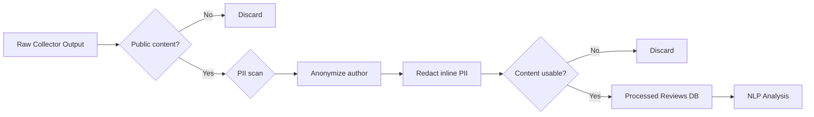

# Phase 0 — Privacy Checklist

**Date:** 2026-06-27  
**Purpose:** Task 0.7 — Define PII handling rules, anonymization approach, and compliance checks for all pipeline stages.

---

## Privacy Principles

1. Collect **public content only** — no private accounts, credentials, or internal Spotify data.
2. **Minimize** stored personal data — strip PII at processing time, before NLP analysis.
3. **Anonymize** all usernames and author identifiers before storage in the processed database.
4. **Never alter** user quote meaning — redact PII inline but preserve sentiment and intent.
5. **Attribute** source platform and date — but never expose real usernames in dashboard or reports.

---

## Data Classification

### Never Collect or Store

| Data Type | Examples | Action |
|---|---|---|
| Email addresses | `user@example.com` | Strip; discard record if only content is an email |
| Phone numbers | `+1-555-0123` | Strip via regex |
| Payment information | Credit card numbers | Strip; never requested from sources |
| Account credentials | Passwords, API keys | Never collect |
| Private messages | DMs, private subreddit content | Exclude — public only |
| Spotify listening data | Play history, user stats | Out of scope — prohibited |
| Internal Spotify datasets | Employee data, paid datasets | Prohibited by problem statement |
| IP addresses | User IPs | Do not log |
| Exact geolocation | GPS coordinates | Do not collect |

### Collect with Anonymization

| Data Type | Source | Handling |
|---|---|---|
| Public usernames | Reddit, App Store, Play Store, Forum | Replace with `user_{hash}` before processed storage |
| Display names | App store reviewers | Same anonymization |
| Profile URLs | Reddit author links | Do not store — strip from raw after anonymization |
| Review text | All sources | Keep verbatim except inline PII redaction |

### Safe to Store As-Is

| Data Type | Notes |
|---|---|
| Review/post content (public) | After PII scan |
| Platform name | `reddit`, `play_store`, etc. |
| Posted date | UTC normalized |
| Star rating | 1–5 integer |
| Source URL | Public thread/review URL (no username in URL path) |
| Sentiment label | Derived field |
| Theme/insight aggregates | No individual identifiers |

---

## Anonymization Approach

### Username Anonymization

```python
import hashlib

def anonymize_author(platform: str, author_name: str) -> str:
    """Deterministic anonymous ID — same author always maps to same ID within a platform."""
    salt = "review_discovery_engine_v1"
    digest = hashlib.sha256(f"{salt}:{platform}:{author_name}".encode()).hexdigest()[:8]
    return f"user_{digest}"
```

- Same real author → same anonymous ID (enables deduplication without exposing identity)
- Anonymous IDs are **not reversible** without the original username (which is discarded)
- Dashboard and reports show `user_a1b2c3` — never real usernames

### Inline PII Redaction in Text

| Pattern | Regex Approach | Replacement |
|---|---|---|
| Email | `\b[A-Za-z0-9._%+-]+@[A-Za-z0-9.-]+\.[A-Z|a-z]{2,}\b` | `[EMAIL REDACTED]` |
| Phone | `\b(\+\d{1,3}[-.\s]?)?\(?\d{3}\)?[-.\s]?\d{3}[-.\s]?\d{4}\b` | `[PHONE REDACTED]` |
| URL with credentials | Manual filter | Remove query params from URLs |

---

## Processing Pipeline Privacy Gates



**Gate rules:**
- **Gate 1:** Reject private/restricted content (private subreddits, deleted posts)
- **Gate 2:** Scan for email, phone, credentials in text body
- **Gate 3:** Replace author name with anonymous ID; do not persist original
- **Gate 4:** Redact inline PII; preserve quote meaning
- **Gate 5:** Reject records with < 20 characters after cleaning

---

## Stage-by-Stage Checklist

### Phase 2 — Data Collection

- [ ] Collect only from public endpoints (no login-required content)
- [ ] Do not store Reddit author profile URLs
- [ ] Do not request or store OAuth tokens in collected data
- [ ] Log collection metadata only (counts, dates) — not user data

### Phase 3 — Processing

- [ ] Run PII regex scan on all text fields
- [ ] Anonymize all author fields before writing to `reviews` table
- [ ] Delete or quarantine original usernames after anonymization
- [ ] Generate processing audit log (records dropped for PII)

### Phase 4 — NLP Analysis

- [ ] NLP models run on anonymized text only
- [ ] No usernames passed to external APIs (all processing local)
- [ ] Representative quotes checked for residual PII before storage

### Phase 5 — API

- [ ] API responses never include real usernames or author URLs
- [ ] Search results return anonymized excerpts only
- [ ] No endpoint exposes raw collector payloads

### Phase 6 — Dashboard

- [ ] UI displays anonymous IDs or no author at all
- [ ] Export/report functions apply same anonymization rules
- [ ] No PII in browser local storage or logs

### Phase 8 — Final Audit

- [ ] Manual spot-check 100 random processed records for PII
- [ ] Grep processed database for email/phone regex patterns
- [ ] Confirm no credentials in repo or `.env` committed to Git

---

## Transparency Requirements (from Problem Statement)

Every insight shown in dashboard and report must include:

| Field | Privacy-Safe Implementation |
|---|---|
| Supporting review count | Aggregate number — safe |
| Representative quotes | Anonymized text, PII redacted |
| Source platform(s) | Platform name only — safe |
| Sentiment classification | Derived label — safe |
| Date range | Aggregate date range — safe |
| User identity | **Never shown** — use anonymous ID or omit |

---

## Git & Secrets Hygiene

| Item | Rule |
|---|---|
| `.env` | Never commit — use `.env.example` with placeholders |
| Reddit API credentials | Environment variables only |
| Raw data with usernames | Store locally; add `data/raw/` to `.gitignore` |
| Processed data | Add `data/processed/` to `.gitignore` |
| Model files | Cache locally; do not commit large binaries |

---

## Exit Criteria

- [x] PII fields to strip identified
- [x] Username anonymization approach defined
- [x] Inline redaction patterns documented
- [x] Privacy gates defined per pipeline stage
- [x] Transparency requirements mapped to privacy-safe fields
- [x] Git/secrets hygiene rules documented
